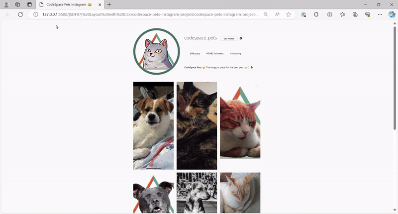

# [SDF03] Challenge: CS Pets Instagram Profile 🐈‍⬛   

Welcome to your **first layout challenge**! This is your opportunity to take your **styling and layout skills** to the next level by recreating an **Instagram-style profile page** using CSS.  

## ✅ **Your Mission**  
Your task is to **style and structure the CodeSpace Pets Instagram Profile page**, ensuring that your project closely matches the reference example. Along the way, you’ll:  
- **Apply CSS styling** to enhance the structure and design of the page.  
- **Use flexbox and grid layouts** to create an Instagram-like profile structure.  
- **Ensure responsiveness**, making sure the page looks great on mobile and desktop.  
- **Implement interactive elements**, including hover effects and a dynamic loading animation.  
- **Submit your completed project** on the [**[Projects Tab](https://learn.codespace.co.za/projects)**].  

---

### 🎯 **What Success Looks Like**  

A well-styled and structured **Instagram-style profile page** that closely matches the provided reference, follows best practices for **CSS layout**, includes interactive elements, and is successfully pushed to GitHub and submitted via the LMS.  

  

### ✅ **Pre-Submission Checklist**  

Before submitting your project, ensure the following:  

- [ ] Your repository **exists under your GitHub account** and contains your updates.  
- [ ] The **HTML structure is correctly formatted** based on the starter code.  
- [ ] **Repo Name Follows the Correct Format** (Includes student number, group, and coach name).   
- [ ] **CSS is applied properly** (No inline styles, all styling in `styles.css`).  
- [ ] **Profile layout follows the reference example** (Correct placement of profile image, username, bio, and stats).  
- [ ] **Navigation & Interactive Elements Work Correctly** (Hover effects, buttons, and image grid behavior).  
- [ ] **Responsive Design is Implemented** (Page adjusts for different screen sizes).  
- [ ] **Repo is Public & Accessible** (Ensure the link works before submission).  
- [ ] **Featured Your Pet** (Snuck a pic of your pet in - if you have one).  

Double-check everything before submitting—**attention to detail matters!**  

### 🚨 **How to Submit Your Challenge** 🚨  

- Rename your repo with your details. Example format:  
  `Module_06_StudentNo_Classcode_Group_Name-Surname_SDF03`  

- Submit your GitHub Repo link through the LMS. You will find the [SDF03] challenge in the **[Projects](https://learn.codespace.co.za/projects)** tab.  

---

## 🚀 **Next Steps**  
This project is your chance to **practice real-world CSS skills** by creating a visually appealing and responsive profile layout. If you run into challenges, **review the reference materials** and reach out to your coach for guidance.  

### **Congrats on Completing Your First Layout Challenge!**  

You’ve just built a fully styled **Instagram-style profile page**—a major step in developing your front-end skills! Every great developer starts with small but meaningful projects like this. Keep refining, experimenting, and pushing your creativity. **You nailed it!**
